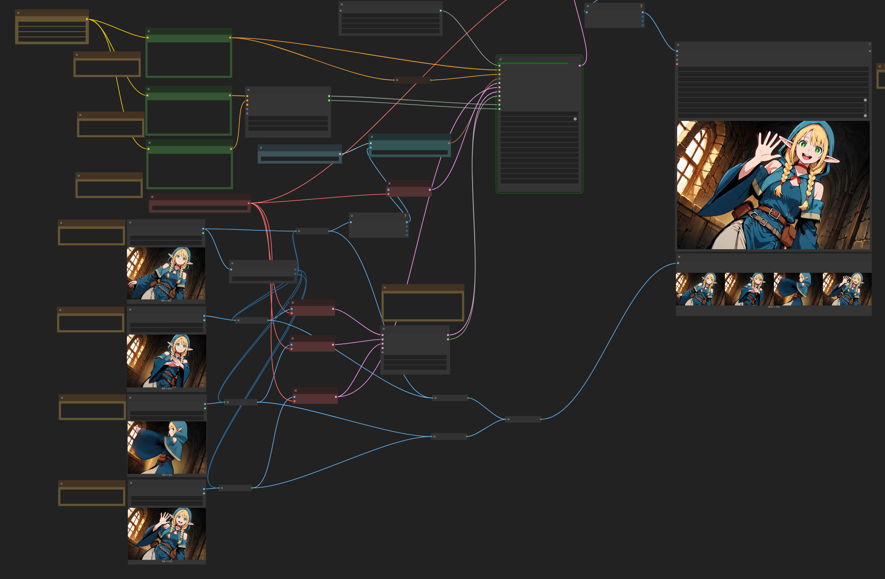

**Notice: This is a fork by nirvash. This repository is a test version for keyframe support, based on original ComfyUI-FramePackWrapper.  
Original repository (kijai): https://github.com/kijai/ComfyUI-FramePackWrapper**

## Abstract
 - FramePack を ComfyUI で利用するためのカスタムノードです.
  kijai 氏のオリジナルに加え, いくつかの機能を追加しています.
 - This is a custom node for using FramePack in ComfyUI.
In addition to the original by kijai, several features have been added.

## How to use
 - [EasyWanVideo](https://github.com/Zuntan03/EasyWanVideo) を利用することで必要な ComfyUI 環境や動画作成に必要なモデルデータを簡単にセットアップすることができます
 - [EasyWanVideo](https://github.com/Zuntan03/EasyWanVideo) allows you to easily set up the necessary ComfyUI environment and model files for video generation.
 - ComfyUI を使い慣れている方は custom_nodes フォルダにこのリポジトリをチェックアウトして利用してください
 - If you're already familiar with ComfyUI, you can simply check out this repository into your custom_nodes folder and start using it.
 - [example_workflows](./example_workflows) にサンプルのワークフローが含まれていますので, そちらを参考にしてください
 - Sample workflows are included in [example_workflows](./example_workflows), so please refer to them.
 
## Start - End
https://github.com/user-attachments/assets/d4af1e9b-904f-41aa-8a00-4306ed4ff4b0
 - 開始画像に加えて, 終了画像を指定することができます
 - In addition to the start image, you can specify an end image.

## Keyframe
https://github.com/user-attachments/assets/23e777e5-dd49-444f-bccf-69b4d00625a2

https://github.com/user-attachments/assets/dbc4444e-5e6d-41ad-b1ff-801f27ca86cf
 - キーフレームを指定することで, 画像の変化を制御することができます
 - By specifying keyframes, you can control the changes in the image.

## Cascade Sampler
https://github.com/user-attachments/assets/7491220b-49b5-4cfe-984d-ea7f71a55610

From left to right:
 - 1: Entire 5-second clip generated at once
 - 2: Split generation for 1 section
 - 3: Split generation for 2 sections
 - 4: Final result generated with 3 samplers.

 - 動画を段階的に生成することができます. 気に入った前段の生成結果が得られたら、その続きを生成することができます
 - You can generate a video in stages. If you are satisfied with the previous stage, you can generate the next stage.

## Feature
 - Set end frame
 - Assign weighted keyframes
 - Use different prompts per section
 - FramePackCascadeSampler can be cascaded for multi-stage processing

# ComfyUI Wrapper for [FramePack by lllyasviel](https://lllyasviel.github.io/frame_pack_gitpage/)

# WORK IN PROGRESS

Mostly working, took some liberties to make it run faster.

Uses all the native models for text encoders, VAE and sigclip:

https://huggingface.co/Comfy-Org/HunyuanVideo_repackaged/tree/main/split_files

https://huggingface.co/Comfy-Org/sigclip_vision_384/tree/main

And the transformer model itself is either autodownloaded from here:

https://huggingface.co/lllyasviel/FramePackI2V_HY/tree/main

to `ComfyUI\models\diffusers\lllyasviel\FramePackI2V_HY`

Or from single file, in `ComfyUI\models\diffusion_models`:

https://huggingface.co/Kijai/HunyuanVideo_comfy/blob/main/FramePackI2V_HY_fp8_e4m3fn.safetensors
https://huggingface.co/Kijai/HunyuanVideo_comfy/blob/main/FramePackI2V_HY_bf16.safetensors
